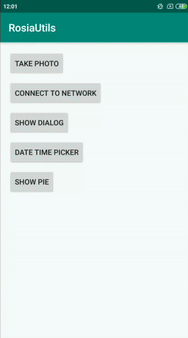

# AndroidUtils
A utility library for picture manger, dialog builder, pie chart, date and time selection view.



## Installation
Add the following dependency in build.gradle file of project level:
``` 
repositories {
        maven { url 'https://jitpack.io' }
    } 
  ```
  
In app level build.gradle file add the following dependency:
```
dependencies {
    implementation 'com.github.RumiRajbhandari:AndroidUtils:0.0.2'
}
```
Also add the following code for Java 8 compatibility:
```
compileOptions {
        targetCompatibility JavaVersion.VERSION_1_8
        sourceCompatibility JavaVersion.VERSION_1_8
    }
```

## Usage
The [sample] project using the library is in app directory.

* ***Picture Manager***: Capturing an image from a camera requires tons of work. It effectively handles all the works along with all the permissions require for capturing an image. 
	* In AndroidManifest declare the provider 

  ```
   <provider
              android:name="androidx.core.content.FileProvider"
              android:authorities="${applicationId}.provider"
              android:exported="false"
              android:grantUriPermissions="true">
              <meta-data
                  android:name="android.support.FILE_PROVIDER_PATHS"
                  android:resource="@xml/path" />
  </provider>
	```
	* Add [path.xml] file inside xml folder of res directory.
	* Check for permission
	```
    if (pictureManager.hasPermission(this)) {
                openCamera()
            }
   ```
   * Override following methods:
   ```
   override fun onRequestPermissionsResult(requestCode: Int, permissions: Array<out String>, grantResults: IntArray) {
        super.onRequestPermissionsResult(requestCode, permissions, grantResults)
        if (pictureManager.onRequestPermissionsResult(requestCode, permissions, grantResults)) openCamera()
    }

    override fun onActivityResult(requestCode: Int, resultCode: Int, data: Intent?) {
        super.onActivityResult(requestCode, resultCode, data)
        pictureManager.onActivityResult(requestCode, resultCode, data)
    }
   ```
   * Start capturing image
   ```
   private fun openCamera() {
        pictureManager.startCameraIntent(this) { imgPath ->
            loadImage(image, imgPath) {
                if (!it) {
                    showToast("something went wrong", TYPE_ERROR)
                } else
                    showToast("success", TYPE_SUCCESS)
            }
        }
    }
   ```

* ***Check Network Availability***: It checks whether a device is connected or not and returns boolean.
  ```
  if (checkNetworkAvailability(this))
      //do something
  else
      //do something
  ```
* ***Dialog Builder***: It is a builder class for creating dialog with tile and buttons.
  ```
  DialogBuilder(this)
  .setTitle("Title")
  .setMessage("This is dialog")
  .setNegativeButton("Cancel") {}
  .setPositiveButton("OK") {}
  .create()
  .show()
  ```
* ***Date Picker***: It is a view that is used for picking up a date from calender and automatically fills up the selected date in an edittext.
  ```
  <com.evolve.rosiautils.DateSelectionView
          android:layout_width="wrap_content"
          android:layout_height="wrap_content"
          android:text="mm/dd/yyyy"/>
  ```
* ***Time Picker***: Similar to date picker, it is used to selected custom time.
  ```
   <com.evolve.rosiautils.TimeSelectionView
          android:layout_width="wrap_content"
          android:layout_height="wrap_content"
          android:text="hh:mm"/>
  ```
* ***Pie Graph***: It can be used to draw a pie chart.
  ```
   <com.evolve.rosiautils.PieGraph
          android:id="@+id/pie_graph"
          android:layout_width="200dp"
          android:layout_height="200dp" />
  ```


[sample]: https://github.com/RumiRajbhandari/AndroidUtils/tree/master/app
[path.xml]: https://github.com/RumiRajbhandari/AndroidUtils/tree/master/app/src/main/res/xml

